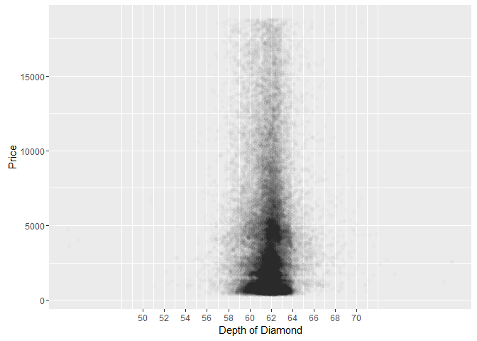

Exploratory Analysis of Diamonds
================================

#### Diamonds Dataset is used from the ggplot2 package from RStudio

Loading the dataset.
--------------------

Exploring the dimension, format and data types of the attributes.

    library(ggplot2)
    data(diamonds)

    dim(diamonds)

    ## [1] 53940    10

    str(diamonds)

    ## Classes 'tbl_df', 'tbl' and 'data.frame':    53940 obs. of  10 variables:
    ##  $ carat  : num  0.23 0.21 0.23 0.29 0.31 0.24 0.24 0.26 0.22 0.23 ...
    ##  $ cut    : Ord.factor w/ 5 levels "Fair"<"Good"<..: 5 4 2 4 2 3 3 3 1 3 ...
    ##  $ color  : Ord.factor w/ 7 levels "D"<"E"<"F"<"G"<..: 2 2 2 6 7 7 6 5 2 5 ...
    ##  $ clarity: Ord.factor w/ 8 levels "I1"<"SI2"<"SI1"<..: 2 3 5 4 2 6 7 3 4 5 ...
    ##  $ depth  : num  61.5 59.8 56.9 62.4 63.3 62.8 62.3 61.9 65.1 59.4 ...
    ##  $ table  : num  55 61 65 58 58 57 57 55 61 61 ...
    ##  $ price  : int  326 326 327 334 335 336 336 337 337 338 ...
    ##  $ x      : num  3.95 3.89 4.05 4.2 4.34 3.94 3.95 4.07 3.87 4 ...
    ##  $ y      : num  3.98 3.84 4.07 4.23 4.35 3.96 3.98 4.11 3.78 4.05 ...
    ##  $ z      : num  2.43 2.31 2.31 2.63 2.75 2.48 2.47 2.53 2.49 2.39 ...

    summary(diamonds)

    ##      carat               cut        color        clarity     
    ##  Min.   :0.2000   Fair     : 1610   D: 6775   SI1    :13065  
    ##  1st Qu.:0.4000   Good     : 4906   E: 9797   VS2    :12258  
    ##  Median :0.7000   Very Good:12082   F: 9542   SI2    : 9194  
    ##  Mean   :0.7979   Premium  :13791   G:11292   VS1    : 8171  
    ##  3rd Qu.:1.0400   Ideal    :21551   H: 8304   VVS2   : 5066  
    ##  Max.   :5.0100                     I: 5422   VVS1   : 3655  
    ##                                     J: 2808   (Other): 2531  
    ##      depth           table           price             x         
    ##  Min.   :43.00   Min.   :43.00   Min.   :  326   Min.   : 0.000  
    ##  1st Qu.:61.00   1st Qu.:56.00   1st Qu.:  950   1st Qu.: 4.710  
    ##  Median :61.80   Median :57.00   Median : 2401   Median : 5.700  
    ##  Mean   :61.75   Mean   :57.46   Mean   : 3933   Mean   : 5.731  
    ##  3rd Qu.:62.50   3rd Qu.:59.00   3rd Qu.: 5324   3rd Qu.: 6.540  
    ##  Max.   :79.00   Max.   :95.00   Max.   :18823   Max.   :10.740  
    ##                                                                  
    ##        y                z         
    ##  Min.   : 0.000   Min.   : 0.000  
    ##  1st Qu.: 4.720   1st Qu.: 2.910  
    ##  Median : 5.710   Median : 3.530  
    ##  Mean   : 5.735   Mean   : 3.539  
    ##  3rd Qu.: 6.540   3rd Qu.: 4.040  
    ##  Max.   :58.900   Max.   :31.800  
    ## 

Univariate Analysis - Price vs Number of Diamonds
-------------------------------------------------

    qplot(x = price, data = diamonds, fill = I('blue'), color = I('black'),
          binwidth = 450)+
      scale_x_continuous(breaks = seq(0,20000, 2000))+
      ylab('Number of Diamonds')+
      xlab('Price')

### Limiting the number of diamonds and adjusting the binwidth.

    qplot(x = price, data = diamonds, binwidth = 25) +
      scale_x_continuous(breaks = seq(0, 10000, 1000), limits = c(0, 10000)) +
      ylab('Number of Diamonds')+
      xlab('Price')

### Dividing the plot by the Cut

    qplot(x = price, data = diamonds, fill = I('purple'), color = I('black')) +
      facet_wrap(~cut, ncol = 2)+
      ylab('Number of Diamonds')+
      xlab('Price')

### Making the y-axis flexible.

    qplot(x = price, data = diamonds, fill = I('purple'), color = I('black')) +
      facet_wrap(~cut, ncol = 2, scales = 'free_y')+
      ylab('Number of Diamonds')+
      xlab('Price')

### Using Log\_scale on x-axis.

    qplot(x = carat, data = diamonds, binwidth = .01) +
      facet_wrap(~cut, ncol = 2) +
      scale_x_log10()+
      ylab('Number of Diamonds')+
      xlab('Price')

Color vs Number of Diamonds using Box-Plot
------------------------------------------

    qplot(x = color, data = diamonds, y = price, geom = 'boxplot') +
      coord_cartesian(ylim = c(0, 10000))+
      ylab('Number of Diamonds')+
      xlab('Color')

### Price per Carat

    qplot(x = color, y = price/carat, data = diamonds, geom = 'boxplot')+
      ylab('Price/Carat')+
      xlab('Color')

Carat vs Number of Diamonds
---------------------------

    qplot(x = carat, data = diamonds, geom = 'freqpoly', binwidth = 0.05, color = I('red')) +
      scale_x_continuous(limits = c(0,2.6), breaks = seq(0,2.6,0.20))+
      ylab('Number of Diamonds')+
      xlab('Carat')

Bivariate Analysis - Price vs Dimension
---------------------------------------

    ggplot(aes(x = x, y = price), data = diamonds)+
      geom_point()+
      xlab('x-dimension of Diamond (width)')+
      ylab('Price')

### Relation between price and dimensions of Diamond.

    cor.test(diamonds$x, diamonds$price)

    ## 
    ##  Pearson's product-moment correlation
    ## 
    ## data:  diamonds$x and diamonds$price
    ## t = 440.16, df = 53938, p-value < 2.2e-16
    ## alternative hypothesis: true correlation is not equal to 0
    ## 95 percent confidence interval:
    ##  0.8825835 0.8862594
    ## sample estimates:
    ##       cor 
    ## 0.8844352

    cor.test(diamonds$y, diamonds$price)

    ## 
    ##  Pearson's product-moment correlation
    ## 
    ## data:  diamonds$y and diamonds$price
    ## t = 401.14, df = 53938, p-value < 2.2e-16
    ## alternative hypothesis: true correlation is not equal to 0
    ## 95 percent confidence interval:
    ##  0.8632867 0.8675241
    ## sample estimates:
    ##       cor 
    ## 0.8654209

    cor.test(diamonds$z, diamonds$price)

    ## 
    ##  Pearson's product-moment correlation
    ## 
    ## data:  diamonds$z and diamonds$price
    ## t = 393.6, df = 53938, p-value < 2.2e-16
    ## alternative hypothesis: true correlation is not equal to 0
    ## 95 percent confidence interval:
    ##  0.8590541 0.8634131
    ## sample estimates:
    ##       cor 
    ## 0.8612494

Depth vs Price
--------------

    ggplot(data = diamonds, aes(x = depth, y = price)) + 
      geom_point()+
      xlab('Depth of Diamond')+
      ylab('Price')

### Handling overplotting

    ggplot(data = diamonds, aes(x = depth, y = price)) + 
      geom_jitter(alpha = 1/100) +
      scale_x_continuous(breaks = seq(50, 70, 2) )+
      xlab('Depth of Diamond')+
      ylab('Price')

### Corelation

    cor.test(diamonds$depth, diamonds$price)

    ## 
    ##  Pearson's product-moment correlation
    ## 
    ## data:  diamonds$depth and diamonds$price
    ## t = -2.473, df = 53938, p-value = 0.0134
    ## alternative hypothesis: true correlation is not equal to 0
    ## 95 percent confidence interval:
    ##  -0.019084756 -0.002208537
    ## sample estimates:
    ##        cor 
    ## -0.0106474

Carat vs Price
--------------

    ggplot(aes(x = carat, y = price),
           data = diamonds) + geom_point() + 
      xlim(0, quantile(diamonds$carat, probs = 0.99)) +
      ylim(0, quantile(diamonds$price, probs = 0.99))+
      xlab('Carat')+
      ylab('Price')

Volume vs Price
---------------

    diamonds$volume = diamonds$x * diamonds$y * diamonds$z

    ggplot(aes(x = volume, y = price), data = diamonds) + geom_point()+
      xlab('Volume')+
      ylab('Price')

### Removing the outliers

    diamonds_subset <- subset(diamonds, diamonds$volume >0 & diamonds$volume < 800)
    ggplot(aes(x = volume, y = price), data = diamonds_subset) + geom_point() + 
      geom_smooth()

Multivariate Analysis - Price, Count and Cut
--------------------------------------------

    qplot(x = price, data = diamonds, fill = cut)+
      facet_wrap(~color)+
      xlab('Price')+
      ylab('Number of Diamonds')

### Price, Table and Cut

    ggplot(aes(x = table, y = price), data = diamonds) +
      geom_point(aes(color = cut)) +
      scale_x_continuous(limits = c(50, 80), breaks = seq(50, 80, 2)) +
      scale_color_brewer(type = 'qual')+
      xlab('Table')+
      ylab('Price')

### Price, Volume and Cut

    ggplot(aes(x = volume, y = price),
           data = diamonds) +
      geom_point(aes(color = cut)) +
      scale_x_continuous(limits = c(0, quantile(diamonds$vol, probs = 0.99))) +
      scale_y_continuous(limits = c(0, quantile(diamonds$price, probs = 0.99))) +
      scale_color_brewer(type = 'div')

Price and Carat - Scatterplot Review
------------------------------------

    qplot(x = carat, y = price, data = diamonds,
          xlim = c(0, quantile(diamonds$carat, 0.99)),
          ylim = c(0, quantile(diamonds$price, 0.99))) +
      geom_point(fill = I('brown'), color = I('black'), shape = 21)+
      xlab('Carat')+
      ylab('Price')

Demand of Diamonds - Count on different price scales
----------------------------------------------------

    plot1 <- qplot(x = price, data = diamonds, binwidth = 100) + 
      ggtitle('Price')+
      xlab('Price')+
      ylab('Number of Diamonds')

    plot2 <- qplot(x = price, data = diamonds, binwidth = 0.01) +
      ggtitle('Price (log10)') +
      scale_x_log10()+
      xlab('Price')+
      ylab('Number of Diamonds')

    grid.arrange(plot1, plot2, ncol = 2)

ScatterPlot Transformation
--------------------------

    ggplot(aes(x = carat, y = price), data = diamonds) +
      geom_point()+
      scale_y_continuous(trans = log10_trans()) +
      ggtitle("price log(10) by carat")

### Cube-Root Transformation

    cuberoot_trans = function() trans_new('cuberoot', transform = function(x) x^(1/3),
                                          inverse = function(x) x^3)
    ggplot(aes(carat, price), data = diamonds) + 
      geom_point() + 
      scale_x_continuous(trans = cuberoot_trans(), limits = c(0.2, 3),
                         breaks = c(0.2, 0.5, 1, 2, 3)) + 
      scale_y_continuous(trans = log10_trans(), limits = c(350, 15000),
                         breaks = c(350, 1000, 5000, 10000, 15000)) +
      ggtitle('Price (log10) by Cube-Root of Carat')

### Handling Over-plotting

    ggplot(aes(carat, price), data = diamonds) + 
      geom_point(alpha = 1/2, size = 3/4, position = 'jitter') + 
      scale_x_continuous(trans = cuberoot_trans(), limits = c(0.2, 3),
                         breaks = c(0.2, 0.5, 1, 2, 3)) + 
      scale_y_continuous(trans = log10_trans(), limits = c(350, 15000),
                         breaks = c(350, 1000, 5000, 10000, 15000)) +
      ggtitle('Price (log10) by Cube-Root of Carat')

### Price vs Carat and Color

    ggplot(aes(x = carat, y = price, color = color), data = diamonds) + 
      geom_point(alpha = 0.5, size = 1, position = 'jitter') +
      scale_color_brewer(type = 'div',
        guide = guide_legend(title = 'Color', reverse = T,
        override.aes = list(alpha = 1, size = 2))) +  
      scale_x_continuous(trans = cuberoot_trans(), limits = c(0.2, 3),
        breaks = c(0.2, 0.5, 1, 2, 3)) + 
      scale_y_continuous(trans = log10_trans(), limits = c(350, 15000),
        breaks = c(350, 1000, 5000, 10000, 15000)) +
      ggtitle('Price (log10) by Cube-Root of Carat and Color')

### Price vs Carat and Clarity

    ggplot(aes(x = carat, y = price, color = clarity), data = diamonds) + 
      geom_point(alpha = 0.5, size = 1, position = 'jitter') +
      scale_color_brewer(type = 'div',
                         guide = guide_legend(title = 'Clarity', reverse = T,
                                              override.aes = list(alpha = 1, size = 2))) +  
      scale_x_continuous(trans = cuberoot_trans(), limits = c(0.2, 3),
                         breaks = c(0.2, 0.5, 1, 2, 3)) + 
      scale_y_continuous(trans = log10_trans(), limits = c(350, 15000),
                         breaks = c(350, 1000, 5000, 10000, 15000)) +
      ggtitle('Price (log10) by Cube-Root of Carat and Clarity')

### Price vs Carat and Cut

    ggplot(aes(x = carat, y = price, color = cut), data = diamonds) + 
      geom_point(alpha = 0.5, size = 1, position = 'jitter') +
      scale_color_brewer(type = 'div',
                         guide = guide_legend(title = 'Cut', reverse = T,
                                              override.aes = list(alpha = 1, size = 2))) +  
      scale_x_continuous(trans = cuberoot_trans(), limits = c(0.2, 3),
                         breaks = c(0.2, 0.5, 1, 2, 3)) + 
      scale_y_continuous(trans = log10_trans(), limits = c(350, 15000),
                         breaks = c(350, 1000, 5000, 10000, 15000)) +
      ggtitle('Price (log10) by Cube-Root of Carat and Cut')

Building Linear Model
---------------------

The final linear model helps us to predict the price of a diamond using
diiferent diamond attributes and their corelation with the price of the
diamond.

    m1 <- lm(I(log(price)) ~ I(carat^(1/3)), data = diamonds)
    m2 <- update(m1, ~ . + carat)
    m3 <- update(m2, ~ . + cut)
    m4 <- update(m3, ~ . + color)
    m5 <- update(m4, ~ . + clarity)
    mtable(m1, m2, m3, m4, m5)

    ## 
    ## Calls:
    ## m1: lm(formula = I(log(price)) ~ I(carat^(1/3)), data = diamonds)
    ## m2: lm(formula = I(log(price)) ~ I(carat^(1/3)) + carat, data = diamonds)
    ## m3: lm(formula = I(log(price)) ~ I(carat^(1/3)) + carat + cut, data = diamonds)
    ## m4: lm(formula = I(log(price)) ~ I(carat^(1/3)) + carat + cut + color, 
    ##     data = diamonds)
    ## m5: lm(formula = I(log(price)) ~ I(carat^(1/3)) + carat + cut + color + 
    ##     clarity, data = diamonds)
    ## 
    ## =========================================================================
    ##                      m1         m2         m3         m4         m5      
    ## -------------------------------------------------------------------------
    ##   (Intercept)      2.821***   1.039***   0.874***   0.932***   0.415***  
    ##                   (0.006)    (0.019)    (0.019)    (0.017)    (0.010)    
    ##   I(carat^(1/3))   5.558***   8.568***   8.703***   8.438***   9.144***  
    ##                   (0.007)    (0.032)    (0.031)    (0.028)    (0.016)    
    ##   carat                      -1.137***  -1.163***  -0.992***  -1.093***  
    ##                              (0.012)    (0.011)    (0.010)    (0.006)    
    ##   cut: .L                                0.224***   0.224***   0.120***  
    ##                                         (0.004)    (0.004)    (0.002)    
    ##   cut: .Q                               -0.062***  -0.062***  -0.031***  
    ##                                         (0.004)    (0.003)    (0.002)    
    ##   cut: .C                                0.051***   0.052***   0.014***  
    ##                                         (0.003)    (0.003)    (0.002)    
    ##   cut: ^4                                0.018***   0.018***  -0.002     
    ##                                         (0.003)    (0.002)    (0.001)    
    ##   color: .L                                        -0.373***  -0.441***  
    ##                                                    (0.003)    (0.002)    
    ##   color: .Q                                        -0.129***  -0.093***  
    ##                                                    (0.003)    (0.002)    
    ##   color: .C                                         0.001     -0.013***  
    ##                                                    (0.003)    (0.002)    
    ##   color: ^4                                         0.029***   0.012***  
    ##                                                    (0.003)    (0.002)    
    ##   color: ^5                                        -0.016***  -0.003*    
    ##                                                    (0.003)    (0.001)    
    ##   color: ^6                                        -0.023***   0.001     
    ##                                                    (0.002)    (0.001)    
    ##   clarity: .L                                                  0.907***  
    ##                                                               (0.003)    
    ##   clarity: .Q                                                 -0.240***  
    ##                                                               (0.003)    
    ##   clarity: .C                                                  0.131***  
    ##                                                               (0.003)    
    ##   clarity: ^4                                                 -0.063***  
    ##                                                               (0.002)    
    ##   clarity: ^5                                                  0.026***  
    ##                                                               (0.002)    
    ##   clarity: ^6                                                 -0.002     
    ##                                                               (0.002)    
    ##   clarity: ^7                                                  0.032***  
    ##                                                               (0.001)    
    ## -------------------------------------------------------------------------
    ##   R-squared            0.9        0.9        0.9        1.0        1.0   
    ##   adj. R-squared       0.9        0.9        0.9        1.0        1.0   
    ##   sigma                0.3        0.3        0.3        0.2        0.1   
    ##   F               652012.1   387489.4   138654.5    87959.5   173791.1   
    ##   p                    0.0        0.0        0.0        0.0        0.0   
    ##   Log-likelihood   -7962.5    -3631.3    -1837.4     4235.2    34091.3   
    ##   Deviance          4242.8     3613.4     3380.8     2699.2      892.2   
    ##   AIC              15931.0     7270.6     3690.8    -8442.5   -68140.5   
    ##   BIC              15957.7     7306.2     3762.0    -8317.9   -67953.7   
    ##   N                53940      53940      53940      53940      53940     
    ## =========================================================================
